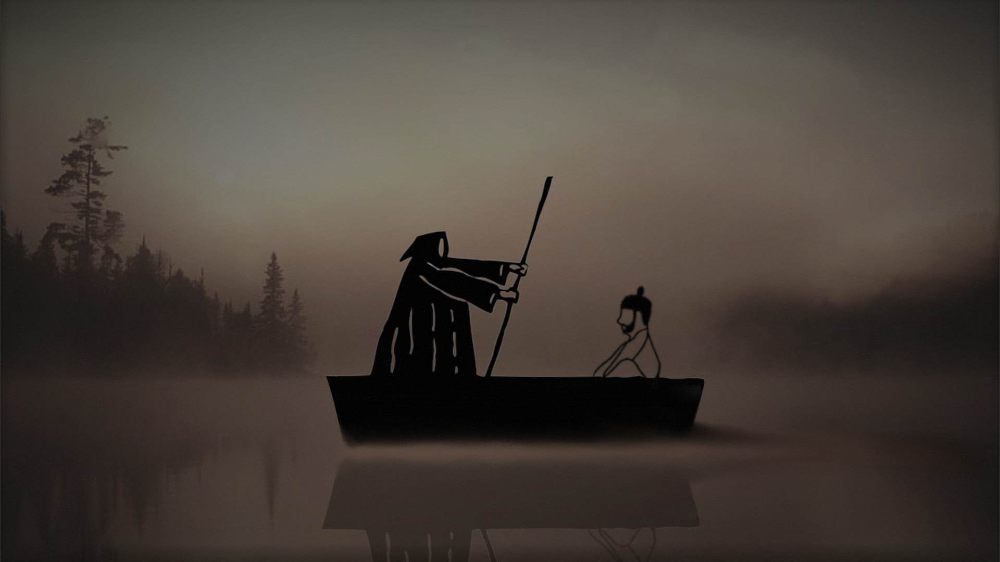

# Charon
  
  
>고려시대, 원을 피해 강화도로 도망가는 왕을 배에 태우고 이동하던 `손돌`은 왕의 오해를 받아 역적으로 처형 당한다.
>억울한 죽음을 맞이한 손돌은 저승사자이자 뱃사공인 `카론`에게 부탁을 한다. 이승으로 올라가 한 가지의 일만 처리하고 오겠노라고…
>카론은 거절하려 하지만, 손돌에게서 느껴지는 에우로스의 기운과 신기를 느껴, 부탁을 들어줄 테니 카론을 물려 받아달라한다.
>카론의 승락을 받은 손돌은 이승으로 올라가기 위해 저승을 거스르는데…
  
# 🎮게임 소개  
졸업 작품 프로젝트로 짧은 기간동안 진행했던 3D 로그라이트 핵 앤 슬래쉬 게임입니다.  
인력과 컨텐츠, 기간이 부족하여 높은 완성도로 만들진 못했지만, 처음 도전해 본 3D 장르치고는 만족스럽습니다.  
추후, 시간이 남는다면 리팩토링 작업과 컨텐츠 추가 작업을 진행하고 싶네요.  
  
# 🕹️조작법
* 이동 : `WASD`
* 공격 : `마우스 좌 클릭`
* 대쉬 : `스페이스 바`
* 콤보 공격 : 0.5초 안에 마우스 좌 클릭을 하면, 최대 3타까지 모션이 나갑니다.
* 대쉬 공격 : `스페이스 바` + `마우스 좌 클릭`
* 차징 공격 : `마우스 좌 홀딩`
* 스킬 : `Q`
* 상호작용 : `F`
  
#🧑🏻‍💻제작
* `최윤재` (기획)
* `손민균` (서브 기획 및 리소스 관리)
* `정수용` (클라이언트 프로그래밍)
* `김지수` (클라이언트 프로그래밍)
* `최대규` (클라이언트 프로그래밍)
